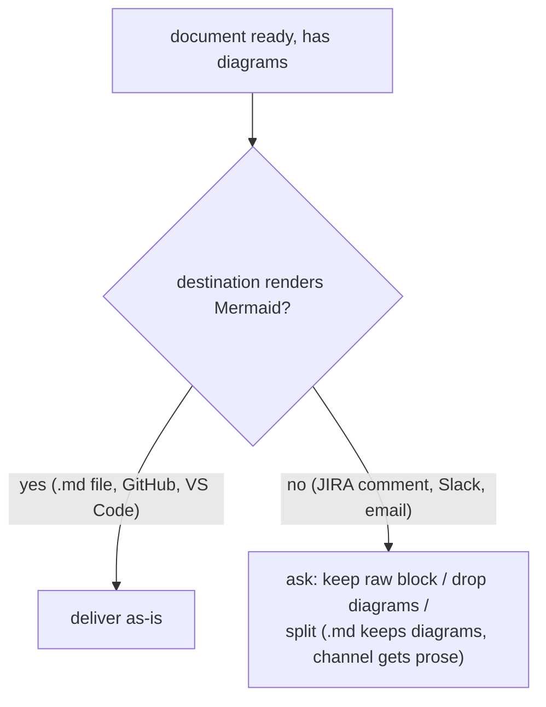

# Diagram convention — skill-generated Markdown documents

Canonical wording of the marketplace diagram convention (ADRs 0005–0009 at the
marketplace repo root). Skills point here; nothing else restates these rules.
To change the convention, change THIS file only.

## Who must follow this

Any skill whose output is a **Markdown document** — ARCHITECTURE.md, a
post-mortem, a design spec, an advisory document, a fit-gap, an audit report, a
trace report. **The artifact decides, not the skill:** if a normally
chat-shaped output (cards, tables, answers) is requested as a `.md` file, the
convention applies to that file.

Exempt: **channel outputs** (Slack, JIRA comment, email, standup line,
Tribletext) and the **CONTEXT.md glossary**.

## Rule 1 — One overview diagram at the top (mandatory)

Every generated Markdown document opens with **one Mermaid diagram showing the
shape of the whole thing** — placed right after the title/header block, before
any prose. It is a thumbnail, not the full model: keep it to roughly ≤ 15
nodes; deep detail belongs in section diagrams.

## Rule 2 — Type-matched section diagrams

Any section whose content describes a flow, data model, decision, or hierarchy
gets a diagram of the matching type:

| Content shape | Mermaid type |
|---|---|
| flow / lifecycle / interaction between actors | `sequenceDiagram` |
| data model / entity relationships | `erDiagram` |
| decision logic / branching | `flowchart TD` |
| hierarchy / pipeline / dependency / org structure | `graph TD` |

No forced diagrams: a pure table/list section stays prose.

## Rule 3 — ADRs carry a small decision diagram

Every ADR opens with one small Mermaid diagram of the decision — typically a
`flowchart TD` of the chosen path vs the rejected alternatives, or the
structure the decision creates. The glossary (CONTEXT.md) is the only exempt
document type.

## Rule 4 — Ask before a non-rendering destination

Diagrams are **always authored**. If the chosen destination doesn't render
Mermaid (JIRA comment, Slack, email), **ask the user first** — never silently
strip, never silently post raw fences:

## Authoring guidance

- Quote node labels containing spaces or punctuation: `A["label with spaces"]`.
- Use ` ` for line breaks inside labels (HTML entities render unreliably).
- Diagrams supplement prose, never replace it — introduce or follow every
  diagram with at least one sentence saying what to see in it.
