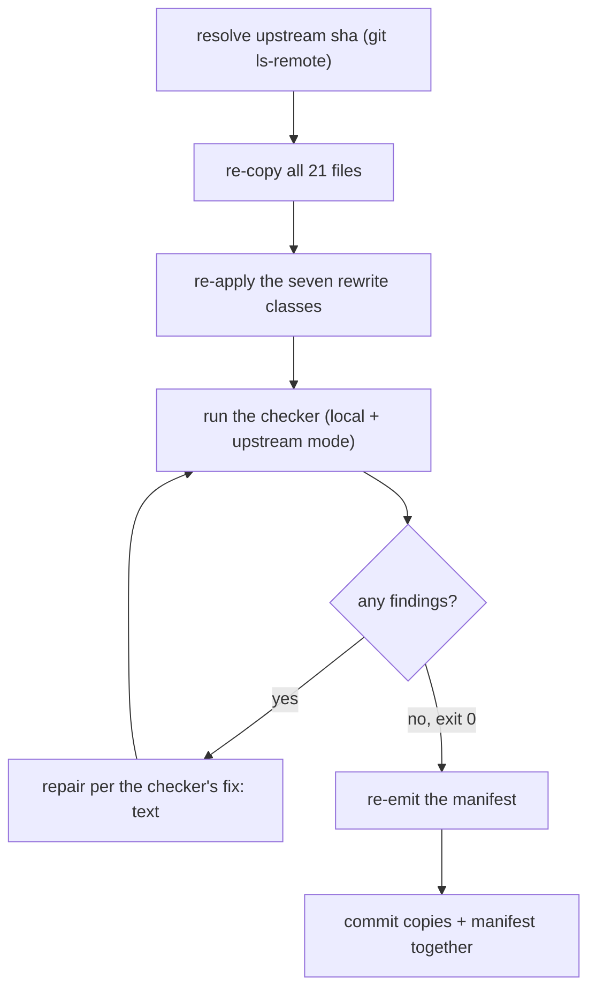

# Resyncing the vendored superpowers copies



This is the procedure a person follows to bring the 21 vendored copies under
`plugins/dev-workflows/skills/sp-*` back in line with a new upstream
`obra/superpowers` commit, using `check_vendored_superpowers.py` to drive the
loop and to prove when it is done. The loop is: resolve the sha upstream is
now at, re-copy the whole set, re-apply the rewrites that make the copies
ours, run the checker, repair whatever it names, re-run until it is clean,
re-emit the manifest, then commit copies and manifest together. The sections
below fill in each box.

## The one network step

Everything starts with a single read-only check against GitHub:

```bash
git ls-remote https://github.com/obra/superpowers HEAD
```

Compare the sha it returns against `upstream.sha` in
`plugins/dev-workflows/references/vendored-superpowers.json` (at the time of
writing: `b36e0829c6d0140e93cfef2ca599b1b07d4a7797`, vendored
`2026-08-16`). If the two match, upstream has not moved since the last vendor
and there is nothing to resync — stop here.

If they differ, obtain `$UP` — a local checkout of upstream's plugin root, at
the sha `git ls-remote` just returned:

```bash
git clone https://github.com/obra/superpowers /tmp/superpowers-upstream
cd /tmp/superpowers-upstream && git checkout <sha-from-ls-remote>
export UP=/tmp/superpowers-upstream
```

## Why all 21 files are re-copied, never a subset

The manifest currently governs 21 files across the 6 wrapped skills
(`sp-brainstorming`, `sp-executing-plans`, `sp-receiving-code-review`,
`sp-requesting-code-review`, `sp-subagent-driven-development`,
`sp-writing-plans`), and every one of those 21 is recorded against the same
single `upstream.sha`.

That single sha is what makes the checker's per-file `state` (`verbatim` or
`edited`) meaningful: `check_upstream_files` compares "what we have" against
"what upstream has right now" (`check_hashes` only compares against the
manifest's own recorded `sha256` from vendor time — it never reads upstream),
and that live comparison only means something if every file was captured at
the same instant. Re-copy a subset at a new sha while leaving the rest at the
old one, and the manifest can no longer tell "we edited this" from "upstream
moved this out from under us" — the two explanations become indistinguishable
for every file that wasn't touched in this pass (ADR 0075). Re-copy the whole
set every time, even the files that turn out unchanged.

**Doing the copy is a manual step — no script under
`plugins/dev-workflows/scripts/` performs it.** Only the checker exists there;
nothing automates the file-by-file copy. The authoritative copy plan is the
manifest itself: for every entry in `copy_set.files`, copy
`$UP/skills/<upstream_path>` over `plugins/dev-workflows/skills/<path>`. Read
both columns straight out of the manifest (`path` is ours, `upstream_path` is
upstream's, both relative to their respective skills roots) rather than
guessing a mapping by hand.

## The seven rewrite classes

After re-copying, seven categories of hand-rewrite get re-applied on top of the
fresh upstream text. Look for these patterns; none of them is a file:line
location, because upstream can move where they land.

- **Class 1 — the two review-dispatch prompts.** Applies only to
  `sp-requesting-code-review/code-reviewer.md` and
  `sp-subagent-driven-development/task-reviewer-prompt.md`. Four of upstream's
  sections collapse into one `## Review method` block that delegates to
  `scrutinize-dispatch`; `code-reviewer.md`'s `## Example Output` section is
  deleted outright; and the `**Reviewer returns:**` line is reworded in both
  files. `re-review-prompt.md` is **excluded** from this class — it is frozen
  and stays byte-identical to upstream (see the manifest's `frozen` entry and
  its `why`); do not rewrite it.
- **Class 2 — cross-skill relative paths.** A relative path that points at a
  sibling vendored skill gets the `sp-` prefix inserted into the skill segment
  of the path. The one exception: `executing-plans`' path into
  `using-superpowers/references/` becomes a qualified `superpowers:` mention
  instead of a path rewrite, because `using-superpowers` itself is not
  vendored.
- **Class 3 — brainstorming's companion path.** Inside `sp-brainstorming`'s
  `SKILL.md`, the path to its visual companion document, originally written
  relative to the plugin root, becomes skill-relative — a bare relative
  filename inside the same skill directory.
- **Class 4 — handoffs naming one of the six.** Any qualified handoff
  (`superpowers:<name>`) that names one of the six vendored skills is rewritten
  to the short `sp-<name>` form. **Bare (unqualified) short names count too** —
  an unprefixed short name resolves to the un-vendored upstream skill with no
  error, and missing that was the Critical defect this checker's bare-name
  check exists to catch (ADR 0087).
- **Class 5 — frontmatter identity.** Each vendored `SKILL.md`'s frontmatter
  `name` and `description` are rewritten; the description names the upstream
  skill this copy displaces, so the displacement is visible on the surface,
  not just in a comment. (The manifest's `permit_list` documents each such
  description line as an intentional, inert bare-name hit.)
- **Class 6 — the two example transcripts.** Upstream's `Strengths:` clause is
  substituted with different wording in two example transcripts, because the
  dispatch engine's output format forbids a `Strengths:` section.
- **Class 7 — the review-model-selection statement.** `sp-requesting-code-review`'s
  `SKILL.md` and `code-reviewer.md` each carry a REQUIRED reviewer
  model-selection statement that upstream does not have — a Model Selection
  section in the skill, plus a `model:` field in the dispatch template — and
  both cross-reference `sp-subagent-driven-development`'s own native Model
  Selection section rather than duplicating it. Don't confuse the two:
  upstream's `subagent-driven-development` already has its own native Model
  Selection section; the one added here lives in `requesting-code-review`,
  which upstream leaves without any model guidance at all. It exists because
  an omitted model silently inherits the dispatching session's, usually the
  most expensive one available. **This class is invisible to
  `check_upstream_files`'s "rewrite pass looks lost" finding** — that finding
  only fires when an `edited` file becomes byte-identical to upstream, and
  these two files still differ from upstream for other reasons (frontmatter,
  Class 1's collapsed sections), so a re-copy that drops this class produces
  no finding at all. Re-apply it by hand every time.

## The three upstream traps

Three upstream changes would leave no broken link and no failed build, so the
checker asserts them directly (`check_upstream_traps`, upstream mode only).
The `repair` text below is copied verbatim from that function — it is what the
checker itself prints when a trap fires.

**Trap 1 — brainstorming's handoff must stay bare.** Upstream's own
`brainstorming` skill directory (`upstream_traps.no_qualified_ref_dir`) must
keep handing off by bare, unqualified name, never a qualified
`superpowers:` reference. If upstream adds a qualified reference there, the
repair is:

> the host hook wins that seam because the reference is contestable prose. A
> qualified reference makes it forced, and the hook stops winning. Re-decide
> the hook

**Trap 2 — the host hook's named-skill set.** Our host hook mirrors upstream's
`using-superpowers/SKILL.md` (`upstream_traps.hook_source`) and expects it to
name exactly the skills in `upstream_traps.hook_named_skills` (currently
`brainstorming` and `systematic-debugging`). Two distinct failures both report
as trap 2:

- if that upstream file is gone, the repair is: `re-derive the hook against upstream's new entry point`
- if the file exists but the named-skill set changed, the repair is:

  > a rename makes our hook a silent no-op; a third name means the hook's
  > coverage is incomplete from this version on

**Trap 3 — the two dead document-reviewer prompts stay dead.**
`upstream_traps.dead_prompts` (`spec-document-reviewer-prompt`,
`plan-document-reviewer-prompt`) must stay unreferenced by any live upstream
file under `upstream_traps.dead_prompt_live_dirs` (`skills`, `hooks`,
`scripts`). If a live file references either one, the repair is:

> upstream is reviving the document-review system: two new review touchpoints,
> arriving unannounced. Decide whether they must route too

## Running the checker

Local mode runs six checks, in this order: `check_copy_set`, `check_hashes`,
`check_bare_names`, `check_qualified_refs`, `check_routing`, `check_frozen`.
Upstream mode runs those same six and then two more on top: `check_upstream_files`
and `check_upstream_traps` — eight checks total (`run_checks`).

```bash
python plugins/dev-workflows/scripts/check_vendored_superpowers.py --strict
python plugins/dev-workflows/scripts/check_vendored_superpowers.py --upstream-dir "$UP" --strict
```

`$UP` is a local checkout of upstream's **plugin root** — the directory that
holds its `skills/` — not the `skills/` directory itself.

Exit codes:

- **0** — no findings; or findings were reported but `--strict` was not
  passed.
- **1** — findings exist **and** `--strict` was passed.
- **2** — an operational error, not a finding: the manifest is missing,
  malformed, or missing a required key; `--root` or `--upstream-dir` is not a
  directory; or a declared file could not be read.

Exit 2 also covers two manifest-shape failures that matter because hand-editing
the manifest is a documented workflow (see the next section): a `copy_set.files`
entry missing its `state` key, and a `frozen` entry missing its `why` key. Both
are validated by `load_manifest` before any check runs, so a bad hand-edit fails
cleanly at exit 2 instead of the checker crashing partway through a check.

## Re-emitting the manifest

`--emit-manifest` **prints** a freshly computed manifest to stdout — it never
writes anything itself. Redirect the output to a temp file, then move that file
into place:

```bash
python plugins/dev-workflows/scripts/check_vendored_superpowers.py \
  --emit-manifest --upstream-dir "$UP" > /tmp/manifest.new.json && \
  mv /tmp/manifest.new.json plugins/dev-workflows/references/vendored-superpowers.json
```

**Never redirect straight onto the manifest itself.** The shell truncates the
destination file before the program even starts, so every hand-written key —
`permit_list` reasons, `frozen` whys, the routing lists — reads back as absent
and is lost, silently, with no error from the program. (The program does
detect the resulting empty file on the *next* run and refuses with exit 2
rather than emitting from it — but that is the recovery check, not a reason to
skip the temp file. Emit to a temp file and move it every time.)

Any `permit_list` entry the emit marks `REVIEW:` is a new bare-name hit nobody
has judged yet — a person must decide why it is inert (or that it isn't) and
replace the placeholder before that manifest is committed.

## Two honest limits

State these plainly; neither is settled by a green checker run.

- **The checker asserts that the routing reference exists, not that a dispatch
  obeys it.** `check_routing` confirms `task-reviewer-prompt.md` still names
  the `scrutinize-dispatch` marker — it does not confirm anything ever
  dispatches through that file. `task-reviewer-prompt.md` **has** been used to
  dispatch reviews, but no run through it was ever instrumented to confirm the
  skill actually loaded; only `code-reviewer.md` has an instrumented run. Per
  ADR 0079 that is by design, not a gap — one instrumented run establishes the
  harness mechanism once, and per-file wiring (this checker) is what covers
  the rest. A review report having the right headings is not evidence the
  skill loaded: a capable reviewer holding the output contract produces the
  same headings without loading anything, which is why the signal is the
  tool_use record, not the report's content.
- **Whether the harness accepts a bare skill literal is still unmeasured.** The
  bare-name check (class 4, and `check_bare_names`) asserts that no
  *unintended* bare name exists in the copies. It says nothing about whether a
  bare handoff actually resolves the way a qualified one does when a harness
  dispatches it. A green run does not settle that question — it only means the
  copies match what the manifest currently expects.
