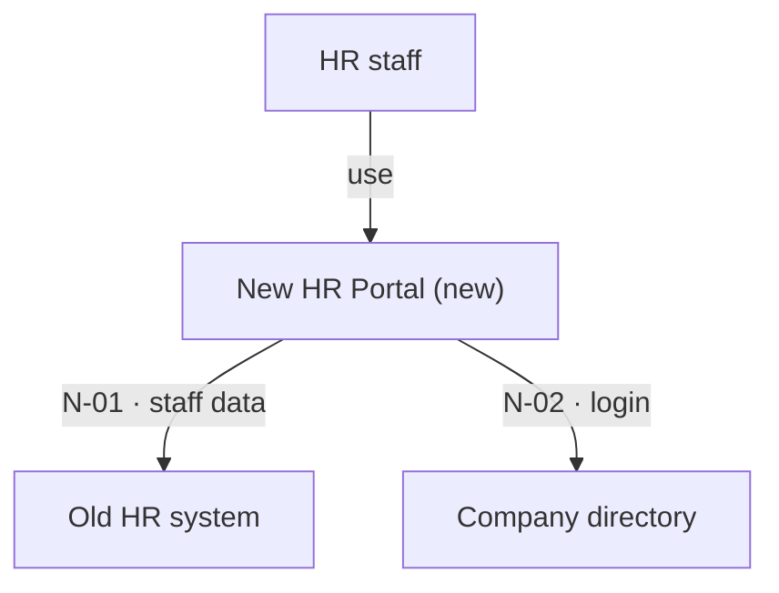
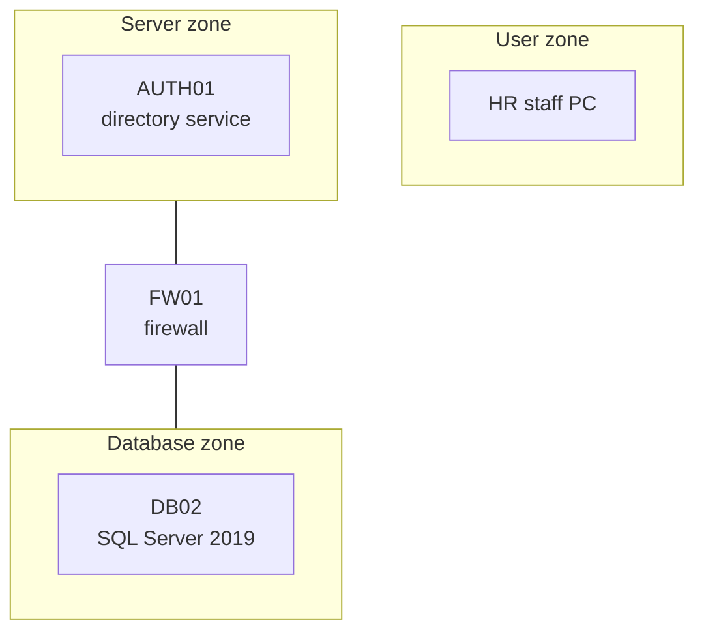
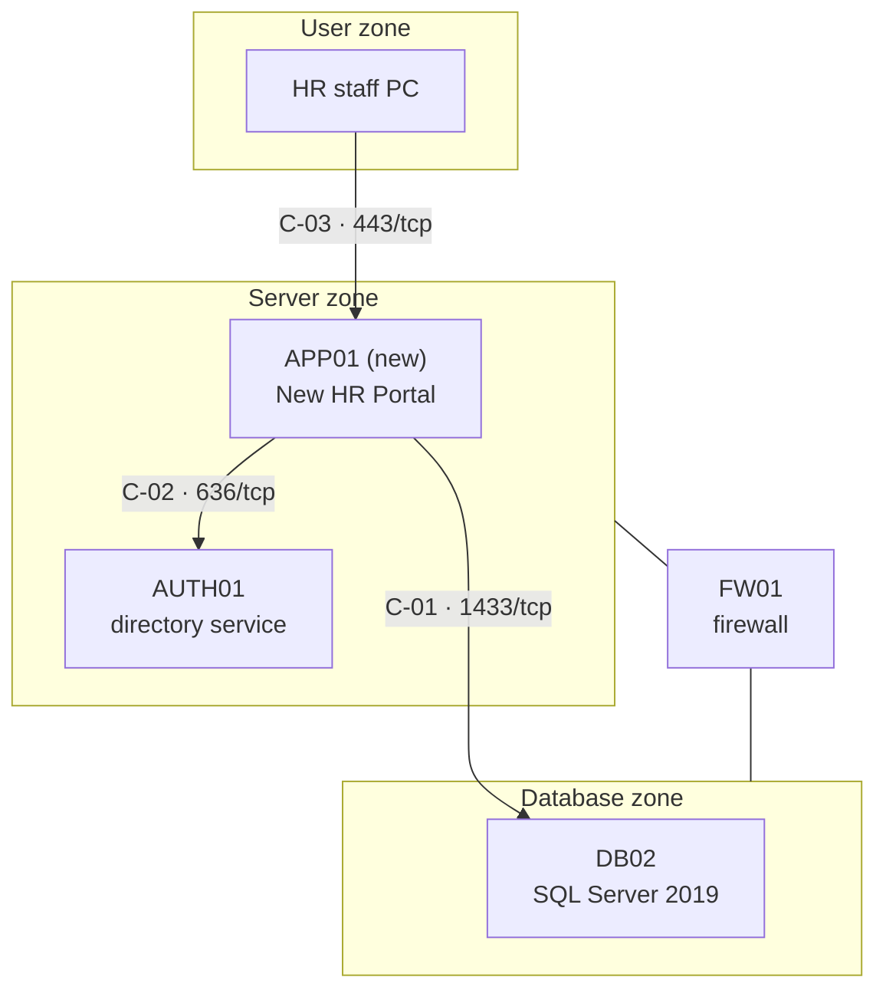
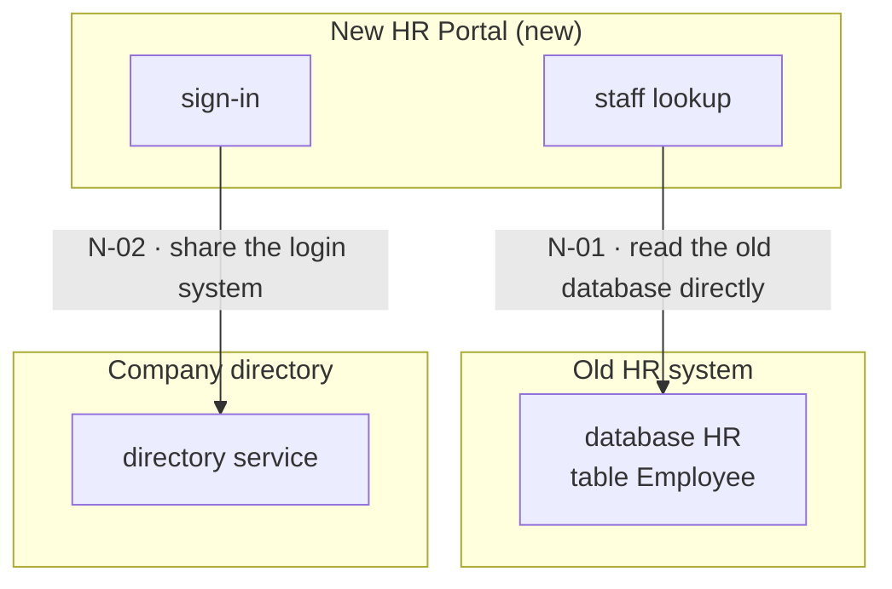
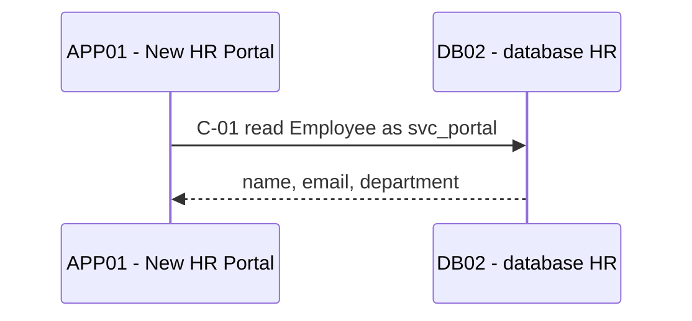
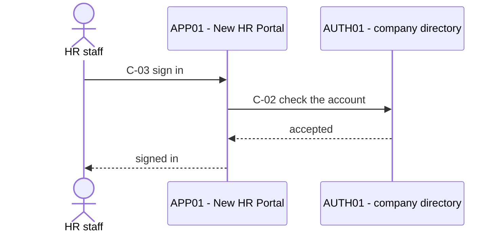

# The architecture document

Read this before you create the document (Phase 1) and again before you make the views
(Phase 6). It gives the layout, the tables, the rules for a row, the five views, a worked
example, and the tests that only read.

## One document, one environment

One document describes one environment and names it in its header. A second environment is a
second document: a port that answers in UAT says nothing about production. Save it where the
user says; the default is `docs/architecture/<system>-<environment>.md`.

## The layout

The order is fixed, so that a reader — or a run that resumes — finds the open rows in the same
place every time.

1. **Header** — system, environment, status, the boundary sentence, the date of the last change
   to any row.
2. **The context view** — the overview diagram, directly under the header, with one sentence
   that says what to see in it.
3. **1. The new system** — the three answers.
4. **2. Needs** — the needs table.
5. **3. The old system as-is** — the old parts, then the deployment view as-is.
6. **4. The new architecture** — the new parts, the connection table, the deployment view
   to-be, the component view, then one sequence diagram per need.
7. **5. Prerequisites** — the prerequisite table.
8. **6. Changes** — the changes table, then the record of each change.
9. **7. Not measured, and owed** — what could not be reached, and the tests that cannot run yet.

The status line reads `to-be`, or `as-built (N of N rows passed, <date>)`.

## The tables

Every row of the four tables ends with the same five columns, so one rule covers them all:

| Column | What it holds |
|---|---|
| **Mark** | `measured` or `told` — for the one fact the table says the mark describes |
| **Test** | the read-only check, and where it runs |
| **Expected** | what the test must print, written before anyone acts |
| **Result** | what the test printed, or `owed` with the reason |
| **Date** | when the result was taken, and by whom when it was not you |

| Table | ID | Columns before the five | The fact its mark describes |
|---|---|---|---|
| Needs | `N-01` | Need · Lives in · Way · Connections | where the thing lives |
| Parts | `S-01` | Part · Kind · Old or new · Zone · Facts | the facts |
| Connections | `C-01` | From · To · Port · Need · State now | the state now |
| Prerequisites | `P-01` | Server · Necessary · Source · Installed now | what is installed now |

- **Kind** is one of: server, database, firewall, user device, external service.
- **Zone** is a label, not a row: the name of the network zone the part sits in. The deployment
  views group parts by it.
- **Need**, in the connection table, is the ID of the need the connection serves. A connection
  that serves no need of the old system — users reaching the new system — has `—` and its reason
  in a few words.
- **State now** is one of: answers, blocked, not known.
- **Source** is where the requirement comes from — a vendor page, the user's word. A
  requirement has a source, not a mark.
- The parts table is one table with one sequence of IDs, printed in two halves: the old parts in
  section 3, the new parts at the top of section 4.

Changes are a fifth table, without the five columns:

| Column | What it holds |
|---|---|
| **ID** | `CH-01` |
| **Change** | the one thing a person must do |
| **For row** | the row that cannot pass without it |
| **Owner** | who makes the change — a person or a team |
| **Status** | to do, handed over, done, checked |

Under the changes table, each change has its own record: the eight steps of
`references/change-steps.md`, filled in.

## The rules for a row

- A row is **open** until its mark is `measured` and its result equals its expected result.
- A told fact becomes measured when its test passes. The result and its date stay in the row.
- A part with no fact that a command can read — a firewall whose rules nobody here can show —
  has `—` in its five columns and is never counted as open. Its effect is tested by the
  connection rows that cross it.
- The document is **as-built** when no row is open, no change is unchecked and no test is owed.
  There is no "as-built with exceptions": a row that cannot pass keeps the document to-be, and
  section 7 says why.
- An ID is never reused. A row that is dropped keeps its ID and says why it was dropped.
- A fact changes in its row and nowhere else. Then make the arrow, the test and the change again
  from the row.
- A connection test runs on the row's From part. A test from any other machine does not count.

## The five views

Each view is a Mermaid diagram, of the type the Diagram convention gives its shape: `graph TD`
for the four structural views, `sequenceDiagram` for the fifth. In this skill "UML" names the
view; the notation is Mermaid.

| View | Made from | Rule |
|---|---|---|
| Context view | needs | one box for the new system, one per group of users, one per old system a need names; one edge per need, labelled with its ID and what is needed |
| Deployment view as-is | parts that are old | one `subgraph` per zone; one box per part; a firewall is a box joined by plain lines to the zones it separates |
| Deployment view to-be | all parts, and connections | the as-is view plus the new parts, each label ending in `(new)`; exactly one arrow per connection row, labelled with its ID and port |
| Component view | needs | the software parts on both sides; one edge per need, labelled with its ID and the chosen way |
| Sequence diagram | one need and its connections | one diagram per need; each message that crosses a connection starts with the connection's ID |

Rules for all five:

- Where a box is a row, its node id is the row's ID without the hyphen — `S01` for `S-01`.
- Quote every label. Use `<br/>` for a line break, and no other tag inside a label.
- An arrow (`-->`) is a connection or a need. A plain line (`---`) only shows where a firewall
  sits; it is never a connection.
- Follow or introduce every diagram with one sentence that says what to see in it.

## A worked example

Copy the shape, not the content. The example is small: one new portal, two needs.

````markdown
# New HR Portal — architecture (UAT)

- **System:** New HR Portal
- **Environment:** UAT
- **Status:** to-be
- **Boundary:** the agent reads and tests; every change is made by a person
- **Last change to a row:** 2026-10-03



The new portal gets two things from systems that already run: the staff data and the login.

## 1. The new system

- **What it is, and who uses it:** a portal where HR staff look up staff records.
- **What it runs on:** .NET 8 and its own SQL database, on server APP01.
- **What it must get from the old system:** the staff data, from the old HR system; the login,
  from the company directory.

## 2. Needs

| ID | Need | Lives in | Way | Connections | Mark | Test | Expected | Result | Date |
|---|---|---|---|---|---|---|---|---|---|
| N-01 | Staff data: name, email, department | table `Employee`, database `HR`, on DB02 | read the old database directly, as the read-only account `svc_portal` | C-01 | told | on APP01, as `svc_portal`: read one row of `Employee` | one row is returned | owed — APP01 has no database client yet (P-02) | — |
| N-02 | Login with the company account | the company directory, on AUTH01 | share the login system | C-02 | told | on APP01: one real sign-in through the directory | the sign-in succeeds | owed — the portal is not installed | — |

## 3. The old system as-is

| ID | Part | Kind | Old or new | Zone | Facts | Mark | Test | Expected | Result | Date |
|---|---|---|---|---|---|---|---|---|---|---|
| S-01 | DB02 | database | old | Database zone | SQL Server 2019 | told | on DB02: `SELECT @@VERSION` | a line with `2019` | — | — |
| S-02 | AUTH01 | server | old | Server zone | Windows Server 2019, directory service | told | on AUTH01: `(Get-CimInstance Win32_OperatingSystem).Caption` | a line with `2019` | — | — |
| S-03 | FW01 | firewall | old | between Server zone and Database zone | — | — | — | — | — | — |
| S-04 | HR staff PC | user device | old | User zone | — | — | — | — | — | — |



Today the portal will touch two servers of the old system, in two zones, with one firewall
between the zones.

## 4. The new architecture

New parts:

| ID | Part | Kind | Old or new | Zone | Facts | Mark | Test | Expected | Result | Date |
|---|---|---|---|---|---|---|---|---|---|---|
| S-05 | APP01 | server | new | Server zone | Windows Server 2022 | told | on APP01: `(Get-CimInstance Win32_OperatingSystem).Caption` | a line with `2022` | — | — |

Connections:

| ID | From | To | Port | Need | State now | Mark | Test | Expected | Result | Date |
|---|---|---|---|---|---|---|---|---|---|---|
| C-01 | APP01 | DB02 | 1433/tcp | N-01 | answers, says the 2021 network diagram | told | on APP01: `Test-NetConnection DB02 -Port 1433` | `TcpTestSucceeded : True` | — | — |
| C-02 | APP01 | AUTH01 | 636/tcp | N-02 | not known | — | on APP01: `Test-NetConnection AUTH01 -Port 636` | `TcpTestSucceeded : True` | — | — |
| C-03 | HR staff PC | APP01 | 443/tcp | — users open the portal | not known | — | on an HR staff PC: `Test-NetConnection APP01 -Port 443` | `TcpTestSucceeded : True` | owed — the portal is not installed, nothing listens | — |



The new server APP01 joins the server zone. Three arrows, one per connection row; C-01 is the
one that crosses the firewall.



Two software parts of the portal each depend on one part of the old system; each edge is a need
and the way chosen for it.



N-01: the portal reads the staff data over connection C-01.



N-02: a sign-in crosses C-03 to the portal and C-02 to the directory.

## 5. Prerequisites

| ID | Server | Necessary | Source | Installed now | Mark | Test | Expected | Result | Date |
|---|---|---|---|---|---|---|---|---|---|
| P-01 | APP01 | .NET SDK 8.0 | the portal's install guide, by the user's word | none | told | on APP01: `dotnet --list-sdks` | a line that starts with `8.0.` | — | — |
| P-02 | APP01 | a SQL Server client, to read DB02 | the way chosen for N-01 | none | told | on APP01: `sqlcmd -?` | the help text is printed | — | — |

## 6. Changes

| ID | Change | For row | Owner | Status |
|---|---|---|---|---|
| CH-01 | Install the .NET SDK 8.0 on APP01 | P-01 | the server's administrator | to do |
| CH-02 | Install a SQL Server client on APP01 | P-02 | the server's administrator | to do |
| CH-03 | Create the read-only account `svc_portal`, with read access to table `Employee` | N-01 | the database administrator | to do |

### CH-01 — Install the .NET SDK 8.0 on APP01

1. **Who acts:** the server's administrator installs. The agent reads and tests.
2. **Measured before:** `dotnet --list-sdks` on APP01 — not run yet.
3. **Before-state:** the installed software of APP01, to be saved beside this document as
   `before-CH-01.txt` — not taken yet.
4. **Expected:** `dotnet --list-sdks` prints a line that starts with `8.0.` **Must not
   change:** nothing else runs on APP01 yet, so none is recorded.
5. **Steps:** given when the change starts, in the fixed shape.
6. **Checked after:** —
7. **Problem:** —
8. **Result:** —

CH-02 and CH-03 have the same record.

## 7. Not measured, and owed

- **Not measured:** the rules of firewall FW01 — nobody in the session can read them. Their
  effect on this design is tested by C-01.
- **Owed:** N-01, until P-02 passes; N-02 and C-03, until the portal is installed.
````

## Tests that only read

Starting points for the Test column. What a command prints differs by version and platform:
confirm the expected output — from the tool's documentation or one run — before it goes into a
row.

| To learn | Windows | Linux | It passes when |
|---|---|---|---|
| a port answers | `Test-NetConnection <host> -Port <port>` | `nc -vz <host> <port>` | Windows prints `TcpTestSucceeded : True`; `nc` exits with status 0 |
| a name resolves | `nslookup <name>` | `getent hosts <name>` | an address is printed |
| TLS works on a port | `curl.exe -sI https://<host>:<port>/` | `curl -sI https://<host>:<port>/` | an HTTP status line is printed |
| which .NET SDKs are installed | `dotnet --list-sdks` | `dotnet --list-sdks` | a line starts with the necessary version |
| which Java is installed | `java -version` | `java -version` | the version line shows the necessary version |
| the operating system | `(Get-CimInstance Win32_OperatingSystem).Caption` | `cat /etc/os-release` | the name and version are printed |
| a service runs | `Get-Service -Name <name>` | `systemctl is-active <unit>` | Windows shows `Running`; Linux prints `active` |

A need's own test reads one real item with the real account:

- **A database** — one `SELECT` of one row, run as the real account. Let the tool prompt for the
  password; never put it on the command line or in the document.
- **A directory or sign-in service** — one real sign-in by a real account.
- **An API** — one call that returns one real item, with the key read from where it is stored,
  never typed into the document.
