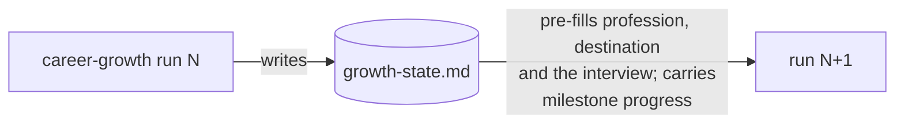

# growth-state.md — contract

The single machine-readable state file the `career-growth` skill maintains in
the user's **career repo** (ADR 0049). One YAML document in a fenced block
inside `growth-state.md`. The skill owns every field; the user may hand-edit
`cadence_months`.



## Schema

```yaml
version: 2                      # contract version — bump only via a new ADR
last_run: 2026-08-26            # ISO date of the last completed full run
cadence_months: 3               # suggested review cadence (user-adjustable)
next_review_due: 2026-11-26     # last_run + cadence_months; printed at wrap-up
profession: "software engineering"   # Step 0 anchor; pass 2a's only input; asked once, ever
declared_destination:           # Step 0; null when the user declares none
  statement: "Solution Architect · Bangkok · Microsoft Business Applications"
  declared_on: 2026-08-26
  last_verdict: "fails `paid` in ring 1; passes in ring 3"   # Station 3's four-test verdict, in prose
chosen_moat: "<one-line moat statement>"   # copied from moat.md when the user picks (Station 4)
moat_adopted_on: 2026-08-26     # date the current moat was picked
milestones:                     # Station 5 output; one entry per milestone, any lane
  - lane: certificate            # certificate | language | published-work | employer-arithmetic | domain-evidence
    gate: "partner designation arithmetic"   # the family gate this milestone serves
    milestone: "pass AB-620"    # the pass/fail statement
    baseline: unvalidated       # measured | unvalidated
    study_hours_estimate: 55    # from the readiness check
    cert:                       # present only on the certificate lane
      code: AB-620              # vendor exam code, exactly as the registry lists it
      status: planned           # planned | studying | scheduled | passed | retired-blocked
      verified_on: 2026-08-26   # date the live registry check last passed
      registry_url: https://learn.microsoft.com/credentials/...
      justification: b          # a = an institution or ring demonstrably reads it
                                 # b = forces capability the readiness check graded unknown
    projects:                   # any lane; [] when that lane plans no project
      - name: <kebab-slug>
        exam_objectives: ["Extend the platform"]   # certificate lane only; absent on a non-cert project
        status: planned         # planned | in-progress | done
        published_url: null     # public repo URL when published; null when private
```

There is no top-level list of gates: the gate a milestone serves travels on
that milestone as `gate:`. There is no `target_certs` key in v2 at all — a
certificate is a `milestones` entry with `lane: certificate` and its own
nested `cert:` sub-object, and mini projects live inside that same entry's
`projects:` list, not in a separate top-level list.

## Rules

- **Full run every time (ADR 0050):** re-runs never skip a station; this file
  only pre-fills (profession, declared destination, the interview) and
  carries milestone progress — it is never a reason to skip fresh evidence
  gathering.
- **`profession` is asked once, ever.** Later rounds confirm it; they do not
  re-ask. A profession that genuinely changed is a new answer, not a
  refinement.
- **`declared_destination` is re-validated every round**, never assumed. Its
  `last_verdict` records, in prose, what the four tests said last time, so a
  destination that keeps failing is visibly failing rather than quietly
  persisting.
- **A certificate-lane milestone needs `cert.justification: a` or `b`.**
  Station 5 drops a cert that cannot earn either and records the drop; a
  certificate-lane milestone with no justification is a contract violation,
  not a default. `a` means an institution or ring demonstrably reads the
  cert; `b` means it forces capability the readiness check graded unknown.
- **`projects:` is allowed on any lane.** Nothing restricts projects to the
  certificate lane: Station 5 designs a project for every other lane too,
  backwards from that gate's own measurement rather than from an exam
  blueprint. What *is* certificate-specific is `exam_objectives`, which is
  simply **absent** on a non-cert project; `name`, `status` and
  `published_url` are the fields every project carries. `[]` is the right
  value only when a lane genuinely plans no project.
- **`baseline: unvalidated` must reach the reader.** `growth-plan.md` labels
  that milestone's size **unvalidated**; nothing downstream re-checks it.
- A cert confirmed retired by a reachable registry is removed from
  `milestones` and its replacement proposed (ADR 0048 rule 1). An
  unreachable registry changes nothing.
- The skill writes this file's `last_run` (and the round's other fields)
  once the user has **approved** the career-repo commit but **before** that
  commit runs, so `growth-state.md` is one of the five files the commit
  covers. `last_run` means "a committed round exists in the career repo": a
  crashed run and a commit the user declines both leave this file unchanged.
- This file is a machine-readable state file and is exempt from the diagram
  convention — the four document artifacts carry the diagrams, the same way
  the CONTEXT.md glossary is exempt.

## Migrating a v1 file

A v1 `growth-state.md` is **read, not rejected**. Migrate it in Step 0 and
say what was carried and what defaulted:

| v1 | v2 |
|---|---|
| `version: 1` | `version: 2` |
| a `target_certs[]` entry (`code`, `name`, `status`, `verified_on`, `registry_url`) | one `milestones` entry, `lane: certificate`, with `cert.code`/`cert.status`/`cert.verified_on`/`cert.registry_url` carried across and `cert.justification` unset |
| a `mini_projects[]` entry with `for_cert: <code>` | folded into that cert's `milestones[].projects[]` |
| a `mini_projects[]` entry with `for_cert: none` | becomes its own lane milestone (no `cert:` sub-object) that carries the project inside its own `projects[]`, keeping the project's `name`, `status` and `published_url`; `exam_objectives` is dropped, being certificate-specific |
| — | `baseline: unvalidated` on every carried milestone (v1 recorded no baseline at all) |
| — | `profession`: ask (it is the once-ever question) |
| — | `declared_destination`: ask; null is the normal answer |
| — | `gate`: unknown on every carried milestone until this round's Station 4 supplies it |

A migrated cert carries no `cert.justification`, so the first round after
migration must supply one — earn `a` or `b` this round — or drop the cert.
That is the intent: v1 plans were built without either test, and migration
does not retroactively grant one.
