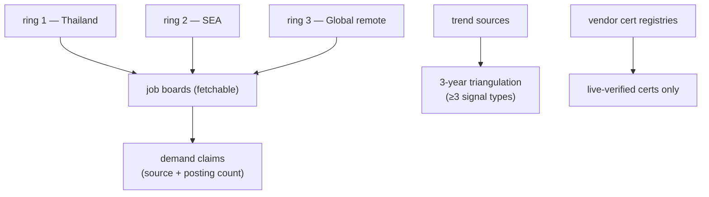

# MARKET station — bounded source list

The fixed per-ring source list that keeps MARKET a single-session stage (ADR 0047)
and the operational detail of the three evidence rules (ADR 0048). Fetchability
shifts — treat "known blocked" entries as *skip immediately*, and when a listed
board starts returning 403, try the alternates before reporting a metric
unavailable, then record the fetchability change in `market-report.md` in the
user's career repo and tell the user to update this reference file in the
plugin **source** if the change looks permanent.

## Ring 1 — Thailand

| Source | Status | Notes |
|---|---|---|
| LinkedIn Jobs (location: Thailand) | fetchable | primary demand signal |
| Indeed Thailand | fetchable | cross-check counts |
| JobsDB (th.jobsdb.com) | **known blocked (403, 2026-07-31)** | skip; do not burn time retrying |

## Ring 2 — SEA (incl. Singapore)

| Source | Status | Notes |
|---|---|---|
| LinkedIn Jobs (SG / MY / VN / ID / PH) | fetchable | primary |
| Indeed Singapore | fetchable | cross-check |
| NodeFlair / regional boards | verify at run time | use only if they serve automated fetch |

## Ring 3 — Global remote

| Source | Status | Notes |
|---|---|---|
| LinkedIn Jobs (remote filter) | fetchable | primary |
| Indeed (remote filter) | fetchable | cross-check |
| We Work Remotely / RemoteOK / Hacker News "Who's hiring" | verify at run time | volume smaller; good rarity signal for niche combos |

## Trend sources (3-year triangulation — pick ≥3 signal *types*)

1. **Vendor roadmaps** — e.g. Microsoft release waves / product roadmaps (fetch the
   current wave; never cite a wave from memory).
2. **Industry & developer surveys** — WEF Future of Jobs, Stack Overflow Developer
   Survey, State of DevOps; use the newest published edition found at run time.
3. **Posting-trend deltas** — `git diff` / `git log` of `market-report.md` across
   runs in the career repo (first run: mark this signal "not yet available").
4. **AI-absorption assessment** — for each candidate skill, argue explicitly what
   share of the work current AI tooling already does, and the 3-year trajectory.

## Vendor certification registries (rule 1 — live verification, NEVER memory)

| Vendor | Where to verify |
|---|---|
| Microsoft | `learn.microsoft.com/credentials/support/retired-certification-exams` + `…/credentials/support/credential-retirement` + the exam study guide's own banner |
| Others (AWS, GCP, Scrum.org, …) | the vendor's own certification-lifecycle / retirement page, found at run time |

A cert may be recommended **only** with: exam code confirmed on a live vendor page,
no retirement listing, and the study guide fetched (its objective domains feed
Station 5's mini-project design). Record `verified_on` + `registry_url` in
`growth-state.md`.
