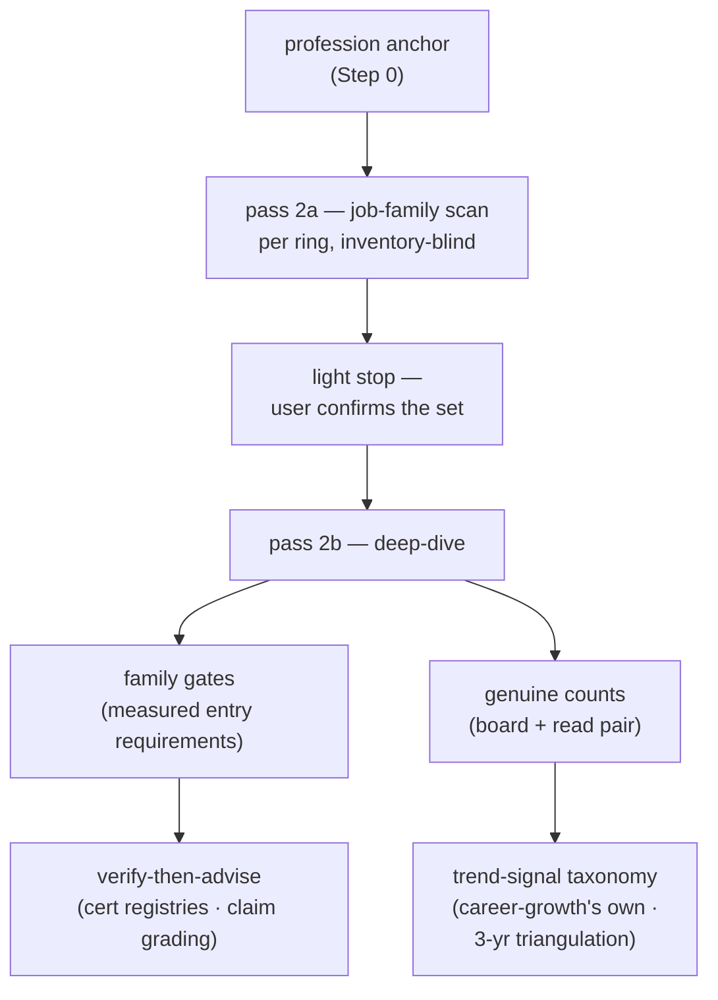

# MARKET station — source list, scan methods and trend taxonomy

The fixed per-ring source list that keeps MARKET a single-session stage
(ADR 0047), the two scan methods its passes run (workflow-daily-work-0148,
-0150), plus career-growth's own trend-signal taxonomy for the 3-year
triangulation. Fetchability shifts — treat "known blocked" entries as *skip
immediately*, and when a listed board starts returning 403, try the
alternates before reporting a metric unavailable, then record the
fetchability change in `market-report.md` in the user's career repo and tell
the user to update this reference file in the plugin **source** if the
change looks permanent.

## Ring 1 — Thailand

| Source | Status | Notes |
|---|---|---|
| LinkedIn Jobs (location: Thailand) | fetchable | primary demand signal |
| Indeed Thailand | fetchable | cross-check counts |
| JobsDB (th.jobsdb.com) | **known blocked (403, 2026-07-31)** | skip; do not burn time retrying |

## Ring 2 — SEA (incl. Singapore)

| Source | Status | Notes |
|---|---|---|
| LinkedIn Jobs (SG / MY / VN / ID / PH) | fetchable | primary |
| Indeed Singapore | fetchable | cross-check |
| NodeFlair / regional boards | verify at run time | use only if they serve automated fetch |

## Ring 3 — Global remote

| Source | Status | Notes |
|---|---|---|
| LinkedIn Jobs (remote filter) | fetchable | primary |
| Indeed (remote filter) | fetchable | cross-check |
| We Work Remotely / RemoteOK / Hacker News "Who's hiring" | verify at run time | volume smaller; good rarity signal for niche combos |

## Pass 2a — enumerating job families

The scan starts from **the profession anchor** captured in Step 0 and from
nothing else. It may not read Station 1's inventory: that is the bias the
two-pass split exists to remove, and a "helpful" narrowing re-creates it.

1. Query each ring for the profession in its own coarse terms, plus the
   ladder words that surround it locally (*engineer, developer, architect,
   lead, consultant, specialist, analyst*).
2. Read the returned **titles** and group them into **job families** — named,
   separately-laddered roles a person is hired *as*. Two titles belong to one
   family when a candidate would apply to either with the same CV.
3. Stop at **8–10 families per ring**. Record which families the cap dropped;
   pass that list to `market-report.md`.
4. Per family, record: ring · titles seen · board count (labeled `unread`) ·
   any entry requirement the list view already shows.
5. Record explicitly where a family has **no ladder in a ring**. "The
   capability exists here but only inside a conventional title" is a finding,
   not a null result.

## Genuine counts — the reading method

A board count is a query artifact, not a market fact. Round 1 of this skill
carried external counts that a later round reproduced at 3–10× lower, and one
board count of 4 held **zero** postings actually about the technology named.
So, per evidence rule 5:

1. Open the result list and read the **first page of returned titles** —
   roughly 10–15 postings; more when the page is shorter than that.
2. Count only the postings genuinely about the family or technology in
   question. An ERP end-user role is not a developer role; an "advantageous"
   mention is not a requirement.
3. **Record both integers** — the board figure and the genuine figure — with
   the query string, the board, and the date. A single number is not
   reportable.
4. A count you did not read is labeled `unread`. A count someone else
   reported is `[External-research]`: a lead to re-measure, never a citable
   figure.
5. Where the two figures diverge sharply, say so in `market-report.md` — the
   ratio itself is a finding about the board.

## Family gates — the fields to extract

For every deep-dived family in pass 2b, extract these from the requirement
text. Absent is a valid value; **unread is not** — say which.

| Field | What to capture | Why it matters |
|---|---|---|
| language | which language, at what level, in what setting (docs / meetings / client-facing) | usually the gate no certificate closes |
| certificates named | exact codes, and whether required or "advantageous" | zero mentions across a ring is itself the finding |
| domain experience | industry, years, depth expected | often the cheapest gate to evidence from existing work |
| lead / delivery | leading people, owning delivery, client ownership | separates a senior IC ladder from an architect ladder |
| location / eligibility | on-site, hybrid, timezone, work authorisation | decides whether a ring is reachable at all |
| seniority signal | title ladder, years, scope of decisions | tells you which rung the plan is aiming at |

Where a board exposes no requirement text at list level, record
"gates not exposed" for that family and say so in `market-report.md`'s
not-checked section. An unmeasured gate must not become a Station 5 lane.

## Trend-signal taxonomy (career-growth's own)

The 3-year outlook requires triangulation — at least three of these signal
types before a trend claim may be stated as anything above `Directional`:

- **Vendor roadmaps** — public roadmap statements or announcements from the
  product vendor about multi-year direction.
- **Industry and developer surveys** — Stack Overflow, JetBrains, vendor-run
  or independent-analyst surveys, read for direction, not headline.
- **Posting-trend deltas** — `git diff` / `git log` of `market-report.md`
  across runs in the user's **career repo**, comparing this round's demand
  counts to the prior round's. On a first run there is no prior round to
  diff against — record the signal as **"not yet available"** rather than
  fabricating a trend from a single data point.
- **AI-absorption assessment** — for each candidate skill, an explicit
  argument for what share of the work current AI tooling already does and
  how that share is likely to move over three years. This feeds the
  four-test moat's `durable` verdict (Station 3).

## Outside this file

The vendor certification **retirement-registry list** and the **four-grade
claim scale** (Verified-primary / Corroborated / Directional / Unverified)
are `verify-then-advise`'s method — see that skill for where to verify a
cert and how to grade a market claim. The per-ring board list above and the
trend-signal taxonomy above are career-growth's own; this file's remaining
job is bounding MARKET's research cost to a single session (ADR 0047).

Once a cert clears that verification, carry the result forward to Station
5's wrap-up write, where it is recorded as `verified_on` + `registry_url` in
`growth-state.md` — that part of the state contract is career-growth's own.
