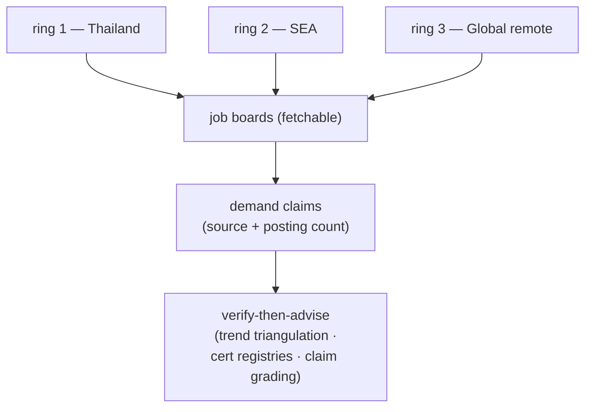

# MARKET station — bounded source list

The fixed per-ring source list that keeps MARKET a single-session stage (ADR 0047)
and the operational detail of the three evidence rules (ADR 0048). Fetchability
shifts — treat "known blocked" entries as *skip immediately*, and when a listed
board starts returning 403, try the alternates before reporting a metric
unavailable, then record the fetchability change in `market-report.md` in the
user's career repo and tell the user to update this reference file in the
plugin **source** if the change looks permanent.

## Ring 1 — Thailand

| Source | Status | Notes |
|---|---|---|
| LinkedIn Jobs (location: Thailand) | fetchable | primary demand signal |
| Indeed Thailand | fetchable | cross-check counts |
| JobsDB (th.jobsdb.com) | **known blocked (403, 2026-07-31)** | skip; do not burn time retrying |

## Ring 2 — SEA (incl. Singapore)

| Source | Status | Notes |
|---|---|---|
| LinkedIn Jobs (SG / MY / VN / ID / PH) | fetchable | primary |
| Indeed Singapore | fetchable | cross-check |
| NodeFlair / regional boards | verify at run time | use only if they serve automated fetch |

## Ring 3 — Global remote

| Source | Status | Notes |
|---|---|---|
| LinkedIn Jobs (remote filter) | fetchable | primary |
| Indeed (remote filter) | fetchable | cross-check |
| We Work Remotely / RemoteOK / Hacker News "Who's hiring" | verify at run time | volume smaller; good rarity signal for niche combos |

## Outside this file

The vendor certification registries, the trend-signal taxonomy (vendor
roadmaps, industry surveys, posting-trend deltas, AI-absorption assessment),
and the claim-grading scale are `verify-then-advise`'s method — see that skill
for where to verify a cert, which signal types count toward the 3-year
triangulation, and how to grade a market claim. This file's remaining job is
only the per-ring board list above, which bounds MARKET's research cost to a
single session (ADR 0047).

Once a cert clears that verification, record its `verified_on` + `registry_url`
in `growth-state.md` — that part of the state contract is career-growth's own.
