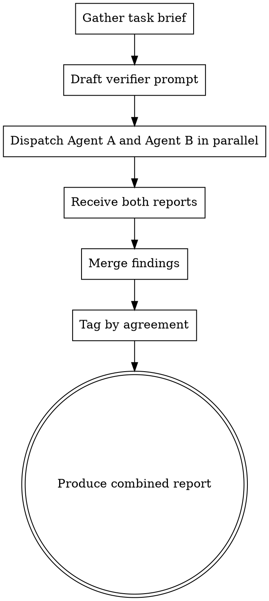

# Dual Verifier

## Overview

A post-implementation review skill that dispatches **two independent subagents** to verify a completed task. Both agents run the **same verification checks** without seeing each other's work. Their findings are then merged into one report — with each finding tagged by which agent(s) caught it.

**Core principle:** One agent can miss things, hallucinate, or rubber-stamp a summary. Two agents working independently catch more issues and — more importantly — when they **disagree** on a finding, that disagreement is itself a signal worth investigating.

**This is NOT just running the same check twice.** The value is independence: each agent must form its own picture of what was actually done by reading the code, the diff, and the test output — not by trusting any summary it was given.

## When to Use

- After an implementation task is complete and the user asks for verification
- Before a commit, PR, or hand-off where over-claiming would cost
- When a previous Claude session said "done" and the user is skeptical
- When the user explicitly invokes a verification slash command

**When NOT to use:**
- During active implementation (let it finish first)
- For brainstorming or design reviews (use `brainstorm-reviewer` instead)
- For style-only review with no functional claims (a single reviewer is sufficient)
- When there is nothing concrete to verify against (no diff, no task statement)

## Inputs the Skill Expects from the User

The user tells you, in conversation, what was implemented. You do not need them to fill in a form. Before dispatching, make sure you have:

1. **What was the task?** — one or two sentences on what was asked for.
2. **What changed?** — files touched, branch, or a diff range. If you don't know, get it (e.g. `git status`, `git diff`, recent edits in the conversation).
3. **Where to look** — repo path or working directory. Default to the current cwd if unspecified.
4. **Any specific claims to challenge** — e.g. "the previous agent said tests pass", "it said the form now validates X". Capture these so the subagents can pressure-test them.

If any of (1)-(3) is missing, ask one short question to fill the gap. Do not dispatch on a vague brief — both agents will then waste effort on different interpretations and their disagreement will be noise, not signal.

## Verification Flow



## Step 1: Draft the Verifier Prompt

Both subagents receive the **exact same prompt**. This is what makes them independent verifiers of the same target rather than two specialists splitting work.

Use this template — fill in the bracketed parts from the task brief:

```
You are an independent verification agent. Another Claude has just completed
an implementation task and we need to confirm — independently — that the work
is actually correct. Do not trust any summary you receive. Read the code, the
diff, and the test output yourself.

## Task that was supposed to be done
[one or two sentences, verbatim from the user where possible]

## Where the work lives
- Repo / working directory: [path]
- Files / branch / diff range: [list or `git diff <range>`]
- Specific claims to pressure-test (if any): [list, or "none"]

## What to check

Go through each of these. For each, produce a finding with a status of
PASS / FAIL / UNCLEAR and a one-sentence evidence line citing a file:line
or a command output.

1. **Requirements match.** Does the code actually implement what was asked,
   or does it implement something adjacent? Read the diff, then re-read the
   task statement, and answer honestly.
2. **Correctness.** Trace the changed code paths. Are there obvious logic
   errors, off-by-ones, wrong operators, missing awaits, swapped arguments,
   wrong table/column names?
3. **Side effects.** Were files changed that have no business being in this
   task? Were files NOT changed that should have been (e.g. a migration was
   added but the model wasn't updated)?
4. **Tests.** Do tests exist for the new behavior? Did they actually run?
   Did they actually pass? Run them yourself if you can; do not trust the
   word "passed" without seeing the output.
5. **Build / type check / lint.** Does the project still build? Are there
   new type errors or lint failures introduced by this change?
6. **Edge cases.** What happens with null, empty, very large, very small,
   duplicate, or concurrent inputs? Pick the two most likely failure modes
   for this kind of change and check them.
7. **Hidden assumptions.** Are there claims in the implementation summary
   that the code does not actually back up? (E.g. "now handles X" but the
   X branch is empty.) List each unbacked claim.
8. **Regression risk.** Does the change touch anything that other features
   depend on? Spot-check the callers/consumers.

## Output format

Return exactly this structure. Be terse. Cite evidence with file:line.

### Summary
<one sentence: overall PASS / FAIL / PARTIAL, with the headline reason>

### Findings
- [SEVERITY] [CHECK#] <finding> — evidence: <file:line or command>
- ...

Severity is one of: BLOCKER, MAJOR, MINOR, NIT.
A BLOCKER means do not ship. A MAJOR means fix before merge. MINOR/NIT
are improvements.

### Claims pressure-tested
- "<claim>" — VERIFIED / NOT VERIFIED / CONTRADICTED — <evidence>

### What I did not check
<list anything you could not verify and why — e.g. "could not run tests, no
test runner found">
```

Save this prompt to a variable before dispatching so both agents receive byte-identical input.

## Step 2: Dispatch Both Agents in Parallel

**Critical:** Both subagents must be dispatched in the **same turn** — i.e. in one message containing two parallel tool calls. If you dispatch one, wait for it, then dispatch the other, the second one can be biased by your reaction to the first. Independence is the whole point.

Use whichever general-purpose subagent type your environment provides. The dispatch:

- Agent A: subagent_type `general-purpose` (or equivalent), short description `Verifier A`, prompt = the verifier prompt verbatim.
- Agent B: subagent_type `general-purpose` (or equivalent), short description `Verifier B`, prompt = the verifier prompt verbatim.

Do not tell either agent about the existence of the other. They should not be "checking each other" — they should each be independently checking the implementation.

While they run, do not start your own verification in the main thread. Wait for both, then synthesise. Doing your own pass risks anchoring on whichever finishes first.

## Step 3: Merge and Tag Findings

When both reports arrive:

1. **Normalize each finding** to a short canonical form: `<check#> <thing> at <file:line>`. Strip prose differences so the same bug from both agents collapses to the same row.
2. **Cluster** findings that refer to the same underlying issue, even if the wording differs. Use file:line and the check number as the join key; fall back to semantic similarity.
3. **Tag each cluster** with which agent(s) raised it:
   - **BOTH** — both agents independently flagged it. High confidence this is real.
   - **A only** — Agent A flagged, Agent B did not. Worth investigating; could be a real issue Agent B missed, or a false positive from Agent A.
   - **B only** — same as above, reversed.
4. **Resolve severity disagreements.** If Agent A said BLOCKER and Agent B said MINOR for the same item, take the higher severity for the merged row but note the disagreement in parentheses.
5. **Pull out direct contradictions.** If Agent A said a check PASSED and Agent B said the same check FAILED, that is a contradiction and goes in its own section — these are the most important things to surface.

## Step 4: Produce the Combined Report

Present this exact structure to the user:

```
## Dual Verification Report

**Task:** <one-line restatement>
**Verified against:** <files / branch / diff range>
**Overall:** PASS / FAIL / PARTIAL — <headline reason>

### Agreement summary
- Findings both agents agreed on: <N>
- Findings only one agent raised: <N> (A: <n>, B: <n>)
- Direct contradictions: <N>

### Blockers and majors (merged, deduplicated)

| Severity | Check | Finding | Evidence | Caught by |
|----------|-------|---------|----------|-----------|
| BLOCKER  | 1     | ...     | file:line| BOTH      |
| MAJOR    | 4     | ...     | ...      | A only    |
| ...      | ...   | ...     | ...      | ...       |

### Contradictions (investigate these first)

For each: what A said, what B said, why they might disagree, what to look at to resolve.

### Minors and nits
<short list, can be terse>

### Claims pressure-tested
| Claim | A | B | Combined verdict |
|-------|---|---|------------------|
| "tests pass" | VERIFIED | NOT VERIFIED | NOT VERIFIED — see contradiction #1 |

### What was not checked
<union of both agents' "did not check" lists>

### Recommended next actions
<short actionable list — fix this, re-run that, ask user about this>
```

The "Caught by" column is the heart of the report. A row tagged BOTH is high-confidence. A row tagged "A only" or "B only" tells the user where to look more carefully — either the issue is real and one agent missed it, or one agent hallucinated and that's worth knowing too.

## Interpreting the Result

Help the user read the report:

- **All findings BOTH, all severities low** → very likely fine to proceed.
- **BOTH agents flag BLOCKER on the same item** → do not ship; fix first.
- **A-only or B-only finding marked BLOCKER** → resolve before trusting. Open the file and look yourself. Do not dismiss it just because the other agent missed it.
- **Any contradiction** → that is the single most important thing on the page. Two competent independent observers disagreed; one of them is wrong, and you do not yet know which. Resolve before claiming the task is done.

## Common Pitfalls

| Pitfall | Why it kills the value | What to do instead |
|---------|-----------------------|--------------------|
| Dispatching the two agents sequentially | The second one anchors on the first's framing through you | Always dispatch in parallel, in the same turn |
| Giving them different prompts | They become specialists, not cross-checkers | Byte-identical prompts. If you want specialists, that's a different skill |
| Letting an agent trust the summary | It becomes a stenographer, not a verifier | The prompt explicitly tells each agent to read the code, not the summary |
| Skipping the "claims pressure-tested" section | Over-claiming goes uncaught | Always pull out specific claims from the original implementer and force them to be verified |
| Hiding the agreement tag in the report | User loses the main signal | "Caught by" column must be visible; contradictions get their own section |
| Treating "A only" as automatically wrong | Misses real issues one agent caught | Treat asymmetric findings as "investigate", not "dismiss" |

## Notes on Independence

Real independence is hard. These help:

- **Same prompt, same time, no shared context.** Done above.
- **No leaks from your own reasoning.** Do not put your own assessment of the task in the prompt. State only the task brief and the location of the work.
- **Do not name the implementer or quote their summary in tone-laden language.** "The implementer claims X" is fine; "The implementer says they fixed X and I think they did" is not.
- **If both agents return suspiciously identical reports**, that is a yellow flag — they may have anchored on the same obvious thing and missed everything else. Re-read the diff yourself and consider re-dispatching with a sharper brief.
