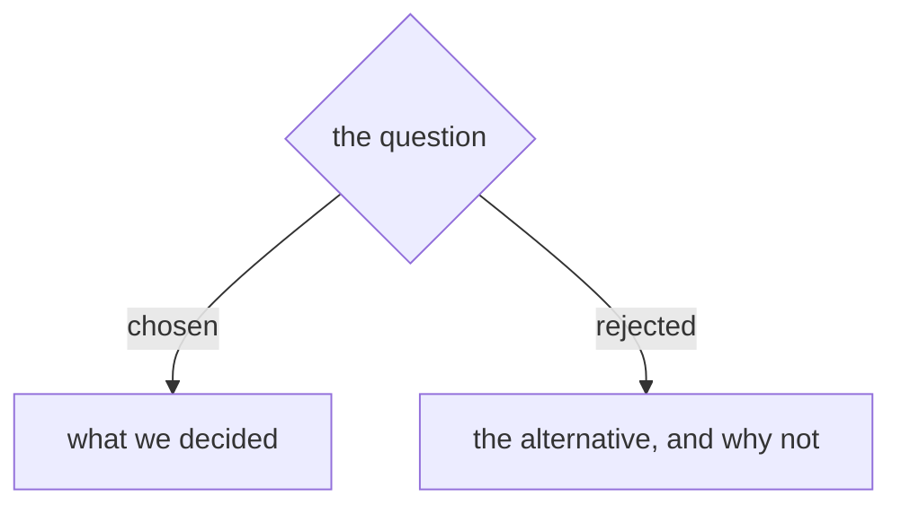

# ADR Format

ADRs live in the repo's ADR directory (usually `docs/adr/`) and are named `<prefix>-<number>-<slug>.md` — for example `orders-0042-event-sourced-write-model.md`. The **prefix** is the project short name and is required (see **The project prefix**). The number is zero-padded and sequential; its **width** is whatever that sequence already uses (three digits and four are both common) — read it off the existing files, as the script under **Numbering** does.

Create the ADR directory lazily — only when the first ADR is needed.

## The project prefix

Every ADR filename opens with the short name of the project that **owns the sequence**,
so a number is never ambiguous once it leaves its repo. `0042` means nothing in a chat
message, a commit body, or another repo's ADR; `orders-0042` resolves anywhere.

**Which short name.** Resolve it in this order and stop at the first hit — only the
last step asks, and it asks once per sequence, ever:

1. **The sequence's highest-numbered file** — the one the numbering script below
   reports. If its filename carries a prefix, that is the name. (Highest-numbered, not
   most-recently-touched: editing an old ADR must not change what the sequence is called.)
2. **The repo's CLAUDE.md / AGENTS.md.** A prefix declared there wins over anything you
   would otherwise infer.
3. **Ask the user.** Propose a default and let them confirm or replace it:
   - a repo-root sequence — the repo's short name (`menunest`, `glasshull`);
   - a sequence owned by one component inside a multi-sequence repo — that
     component's name, not the repo's (`dev-workflows`, `github-backlog`); they are
     separate sequences and would otherwise both mint `0002`;
   - lowercase kebab, no spaces, short enough to type in a citation.

**Write the answer into that repo's CLAUDE.md / AGENTS.md in the same turn, before the
ADR file is created.** That note is the whole reason step 2 ever hits: without it every
future session asks again, and sooner or later one of them answers differently and the
sequence ends up with two spellings of its own name.

**Do not rename existing ADRs.** A sequence that predates the prefix keeps its old
filenames — renaming breaks every citation already written into commits, plans and
other ADRs, for no gain. New ADRs carry the prefix and continue the same numbering;
a mixed sequence is expected and the numbering script reads it correctly.

**Citing.** Use the filename's own prefix and number: `orders-0042`. Within its own
repo a bare `ADR 0042` is still fine; anywhere else it is not. An ADR that predates
the prefix is cited the *same* way — `ado-backlog-0002` — because the prefix names the
**sequence**, not the file. The file keeps its old name and the link still resolves;
only the citation gains the prefix. Without this the convention would cover the few
new ADRs and leave the entire existing corpus uncitable.

## Template

````md
# {Short title of the decision}



{1-3 sentences: what's the context, what did we decide, and why.}
````

Every ADR opens with one small Mermaid decision diagram (see
`${CLAUDE_PLUGIN_ROOT}/references/diagram-convention.md`, Rule 3). Add one
`|rejected|` branch per alternative considered.

That's it. An ADR can be a single paragraph. The value is in recording *that* a decision was made and *why* — not in filling out sections.

## Optional sections

Only include these when they add genuine value. Most ADRs won't need them.

- **Status** frontmatter (`proposed | accepted | deprecated | superseded by ADR-NNNN`) — useful when decisions are revisited
- **Considered Options** — when a rejected option needs more than the one line its
  diagram branch carries
- **Consequences** — only when non-obvious downstream effects need to be called out

## Numbering

Next number = **global max + 1**, where the max spans every ref, every worktree and
every uncommitted file — not just your checkout. Two sessions that each scan only
their own tree mint the same number, and git merges both files without conflict
because the numbers collide but the filenames don't.

Pick the ADR directory first — put the ADR where the existing ADRs on this topic
live. Each directory is its own sequence with its own prefix. Then set that
directory's **repo-root-relative** path and run this; it prints the number to use,
carrying whatever prefix the sequence's highest-numbered file already had.

The script reports the prefix it found; it cannot invent one. If it prints a bare
number, this sequence has not been prefixed yet — prepend the project short name
yourself (that is the transition case, and only the first prefixed ADR hits it).

```bash
cd "$(git rev-parse --show-toplevel)" && d=docs/adr
m=$( { git for-each-ref --format='%(refname:short)' refs/heads refs/remotes refs/stash |
         while IFS= read -r r; do git ls-tree -r --name-only --full-tree "$r" -- "$d"; done
       git ls-files -- "$d"
       git worktree list --porcelain | sed -n 's|^worktree ||p' |
         while IFS= read -r p; do ls "$p/$d" 2>/dev/null; done
     } | sed 's|.*/||' |
     sed -E 's|^([A-Za-z][A-Za-z0-9_-]*-)?([0-9]+)[-.].*|\2 \1|;t;d' | sort -n | tail -1 )
v=${m%% *}; p=${m#* }
[ -n "$v" ] && printf 'next: %s%0*d\n' "$p" "${#v}" $((10#$v + 1)) ||
  echo 'next: ? - no numbered ADR found; check the directory'
```

```powershell
Set-Location (git rev-parse --show-toplevel); $d = 'docs/adr'; $n = @()
git for-each-ref --format='%(refname:short)' refs/heads refs/remotes refs/stash |
  ForEach-Object { $n += git ls-tree -r --name-only --full-tree $_ -- $d }
$n += git ls-files -- $d
git worktree list --porcelain | Where-Object { $_ -like 'worktree *' } |
  ForEach-Object { $p = Join-Path $_.Substring(9) $d
                   if (Test-Path $p) { $n += Get-ChildItem $p -Name } }
$t = $n | ForEach-Object { $_ -replace '.*/','' } | ForEach-Object {
       if ($_ -match '^(?:([A-Za-z][A-Za-z0-9_-]*-))?(\d+)[-.]') {
         [pscustomobject]@{ v = [int]$Matches[2]; w = $Matches[2].Length; p = $Matches[1] } } } |
     Sort-Object v | Select-Object -Last 1
if ($t) { 'next: {0}{1}' -f $t.p, ($t.v + 1).ToString('d' + $t.w) }
else    { 'next: ? - no numbered ADR found; check the directory' }
```

Five ways a hand-rolled version returns a wrong number *silently*: dropping
`--full-tree` (the pathspec then resolves against your cwd, so from a subdirectory
you scan a different sequence at exit 0); word-splitting a worktree path (repo paths
contain spaces — take everything after the literal `worktree ` prefix, and ignore the
HEAD/branch/locked/prunable lines); globbing `**/docs/adr` (folds every sequence and
every nested worktree into one max); incrementing a zero-padded number directly
(`$((0012+1))` is read as octal and yields 11, `$((0059+1))` errors) instead of
stripping the zeros and re-padding to the **same width**; and hard-coding that width,
or assuming a filename starts with a digit. A `^[0-9]{4}` match finds nothing in a
three-digit sequence and nothing behind a `menunest-` prefix, so the max reads as
**empty** and every mint returns `0001` — measured 2026-08-15 against menunest's 168
ADRs, where the previous version of this script did exactly that. A mint that returns
`0001` in a populated sequence is that bug, never an answer.

Empty output from any one source is normal — a branch may predate the directory, a
worktree may not contain it, a stale worktree path is a skip. Only a non-zero exit
from git is a failure; outside a git repo, fall back to listing that one directory
and say that you did, because the number is then only as good as your checkout.
**Mint from the max, never from a gap** — a renumber leaves permanent holes and older
commits still cite the retired number, so filling a hole re-creates the collision.
**Re-run this immediately before you merge or push** — that is when a parallel
session's number first becomes visible, and the merge will not flag the clash.

<!-- numbering-rule v3 — this section is byte-identical in the grill-then-plan and
     sp-grill-with-doc ADR-FORMAT.md twins and in their Antigravity installs. Change
     every copy together, bump the version here, and check with
     `grep -rl 'numbering-rule v3'`. Keep it free of plugin-root tokens and of
     repo-specific paths so the copies can stay identical. Keep it prefix- and
     width-tolerant: it must read every repo's sequence, not impose one shape. -->

Repo-specific routing (which directory new ADRs go in, which short name each sequence
uses, whether older per-component sequences are closed) belongs in that repo's
CLAUDE.md / AGENTS.md, not here. This file mandates *that* a prefix exists, never
which one; the width it does not mandate at all — that it only reads.

## When to write an ADR

Write one for **every** design decision — any point where one option was chosen over
another. One ADR per decision, written the moment it is made, never batched. When in
doubt, write it: a short ADR is better than a missing one, and an ADR that later reads
as obvious cost you a paragraph.

Record the options, not just the winner — every alternative that was genuinely on the
table gets its own `|rejected|` branch in the diagram with a one-line reason for losing.
A decision recorded without its rejected options is half a record: the next reader
re-proposes what you already ruled out.

### Give these extra care

Every decision gets an ADR, but these carry the most weight — give them real reasoning
rather than a bare statement of what was picked:

- **Architectural shape.** "We're using a monorepo." "The write model is event-sourced, the read model is projected into Postgres."
- **Integration patterns between contexts.** "Ordering and Billing communicate via domain events, not synchronous HTTP."
- **Technology choices that carry lock-in.** Database, message bus, auth provider, deployment target. Not every library — just the ones that would take a quarter to swap out.
- **Boundary and scope decisions.** "Customer data is owned by the Customer context; other contexts reference it by ID only." The explicit no-s are as valuable as the yes-s.
- **Deliberate deviations from the obvious path.** "We're using manual SQL instead of an ORM because X." Anything where a reasonable reader would assume the opposite. These stop the next engineer from "fixing" something that was deliberate.
- **Constraints not visible in the code.** "We can't use AWS because of compliance requirements." "Response times must be under 200ms because of the partner API contract."
- **Rejected alternatives.** Every option genuinely on the table already gets a `|rejected|` branch. Where the rejection is subtle — you considered GraphQL and picked REST for non-obvious reasons — spell the reason out in the prose too, or someone will suggest GraphQL again in six months.
