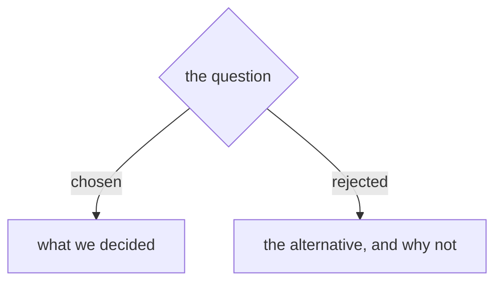

# ADR Format

ADRs live in the repo's ADR directory (usually `docs/adr/`) and use sequential zero-padded numbering: `0001-slug.md`, `0002-slug.md`, etc. The number's **width** is whatever that sequence already uses (three digits and four are both common), and a repo may also put a **name prefix** in front of it (`menunest-0169-slug.md`). Read both off the existing files — the script under **Numbering** does, and so must you.

Create the ADR directory lazily — only when the first ADR is needed.

## Template

````md
# {Short title of the decision}



{1-3 sentences: what's the context, what did we decide, and why.}
````

Every ADR opens with one small Mermaid decision diagram (see
`${CLAUDE_PLUGIN_ROOT}/references/diagram-convention.md`, Rule 3). Add one
`|rejected|` branch per alternative considered.

That's it. An ADR can be a single paragraph. The value is in recording *that* a decision was made and *why* — not in filling out sections.

## Optional sections

Only include these when they add genuine value. Most ADRs won't need them.

- **Status** frontmatter (`proposed | accepted | deprecated | superseded by ADR-NNNN`) — useful when decisions are revisited
- **Considered Options** — only when the rejected alternatives are worth remembering
- **Consequences** — only when non-obvious downstream effects need to be called out

## Numbering

Next number = **global max + 1**, where the max spans every ref, every worktree and
every uncommitted file — not just your checkout. Two sessions that each scan only
their own tree mint the same number, and git merges both files without conflict
because the numbers collide but the filenames don't.

Pick the ADR directory first — put the ADR where the existing ADRs on this topic
live. Each directory is its own sequence, so cite across sequences as
`<owner> ADR NNNN`, never bare. Then set that directory's **repo-root-relative**
path and run this; it prints the number to use.

```bash
cd "$(git rev-parse --show-toplevel)" && d=docs/adr
m=$( { git for-each-ref --format='%(refname:short)' refs/heads refs/remotes refs/stash |
         while IFS= read -r r; do git ls-tree -r --name-only --full-tree "$r" -- "$d"; done
       git ls-files -- "$d"
       git worktree list --porcelain | sed -n 's|^worktree ||p' |
         while IFS= read -r p; do ls "$p/$d" 2>/dev/null; done
     } | sed 's|.*/||' |
     sed -E 's|^([A-Za-z][A-Za-z0-9_-]*-)?([0-9]+)[-.].*|\2 \1|;t;d' | sort -n | tail -1 )
v=${m%% *}; p=${m#* }
[ -n "$v" ] && printf 'next: %s%0*d\n' "$p" "${#v}" $((10#$v + 1)) ||
  echo 'next: ? - no numbered ADR found; check the directory'
```

```powershell
Set-Location (git rev-parse --show-toplevel); $d = 'docs/adr'; $n = @()
git for-each-ref --format='%(refname:short)' refs/heads refs/remotes refs/stash |
  ForEach-Object { $n += git ls-tree -r --name-only --full-tree $_ -- $d }
$n += git ls-files -- $d
git worktree list --porcelain | Where-Object { $_ -like 'worktree *' } |
  ForEach-Object { $p = Join-Path $_.Substring(9) $d
                   if (Test-Path $p) { $n += Get-ChildItem $p -Name } }
$t = $n | ForEach-Object { $_ -replace '.*/','' } | ForEach-Object {
       if ($_ -match '^(?:([A-Za-z][A-Za-z0-9_-]*-))?(\d+)[-.]') {
         [pscustomobject]@{ v = [int]$Matches[2]; w = $Matches[2].Length; p = $Matches[1] } } } |
     Sort-Object v | Select-Object -Last 1
if ($t) { 'next: {0}{1}' -f $t.p, ($t.v + 1).ToString('d' + $t.w) }
else    { 'next: ? - no numbered ADR found; check the directory' }
```

Five ways a hand-rolled version returns a wrong number *silently*: dropping
`--full-tree` (the pathspec then resolves against your cwd, so from a subdirectory
you scan a different sequence at exit 0); word-splitting a worktree path (repo paths
contain spaces — take everything after the literal `worktree ` prefix, and ignore the
HEAD/branch/locked/prunable lines); globbing `**/docs/adr` (folds every sequence and
every nested worktree into one max); incrementing a zero-padded number directly
(`$((0012+1))` is read as octal and yields 11, `$((0059+1))` errors) instead of
stripping the zeros and re-padding to the **same width**; and hard-coding that width,
or assuming a filename starts with a digit. A `^[0-9]{4}` match finds nothing in a
three-digit sequence and nothing behind a `menunest-` prefix, so the max reads as
**empty** and every mint returns `0001` — measured 2026-08-15 against menunest's 168
ADRs, where the previous version of this script did exactly that. A mint that returns
`0001` in a populated sequence is that bug, never an answer.

Empty output from any one source is normal — a branch may predate the directory, a
worktree may not contain it, a stale worktree path is a skip. Only a non-zero exit
from git is a failure; outside a git repo, fall back to listing that one directory
and say that you did, because the number is then only as good as your checkout.
**Mint from the max, never from a gap** — a renumber leaves permanent holes and older
commits still cite the retired number, so filling a hole re-creates the collision.
**Re-run this immediately before you merge or push** — that is when a parallel
session's number first becomes visible, and the merge will not flag the clash.

<!-- numbering-rule v3 — this section is byte-identical in the grill-then-plan and
     sp-grill-with-doc ADR-FORMAT.md twins and in their Antigravity installs. Change
     every copy together, bump the version here, and check with
     `grep -rl 'numbering-rule v3'`. Keep it free of plugin-root tokens and of
     repo-specific paths so the copies can stay identical. Keep it prefix- and
     width-tolerant: it must read every repo's sequence, not impose one shape. -->

Repo-specific routing (which directory new ADRs go in, whether older per-plugin
sequences are closed, whether filenames carry a name prefix and from which number a
new prefix starts) belongs in that repo's CLAUDE.md / AGENTS.md, not here. This file
never mandates a prefix or a width — it only reads whatever is already there.

## When to offer an ADR

All three of these must be true:

1. **Hard to reverse** — the cost of changing your mind later is meaningful
2. **Surprising without context** — a future reader will look at the code and wonder "why on earth did they do it this way?"
3. **The result of a real trade-off** — there were genuine alternatives and you picked one for specific reasons

If a decision is easy to reverse, skip it — you'll just reverse it. If it's not surprising, nobody will wonder why. If there was no real alternative, there's nothing to record beyond "we did the obvious thing."

### What qualifies

- **Architectural shape.** "We're using a monorepo." "The write model is event-sourced, the read model is projected into Postgres."
- **Integration patterns between contexts.** "Ordering and Billing communicate via domain events, not synchronous HTTP."
- **Technology choices that carry lock-in.** Database, message bus, auth provider, deployment target. Not every library — just the ones that would take a quarter to swap out.
- **Boundary and scope decisions.** "Customer data is owned by the Customer context; other contexts reference it by ID only." The explicit no-s are as valuable as the yes-s.
- **Deliberate deviations from the obvious path.** "We're using manual SQL instead of an ORM because X." Anything where a reasonable reader would assume the opposite. These stop the next engineer from "fixing" something that was deliberate.
- **Constraints not visible in the code.** "We can't use AWS because of compliance requirements." "Response times must be under 200ms because of the partner API contract."
- **Rejected alternatives when the rejection is non-obvious.** If you considered GraphQL and picked REST for subtle reasons, record it — otherwise someone will suggest GraphQL again in six months.
