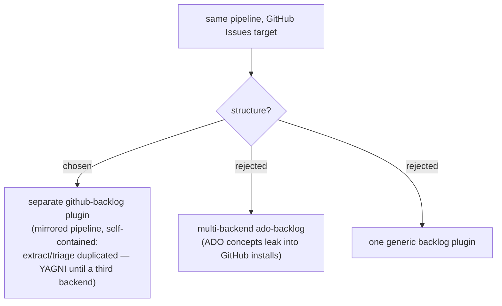

# ADR 0001 — Ship github-backlog as a separate plugin, not a multi-backend ado-backlog

- **Status:** Accepted
- **Date:** 2026-06-02

## Context

The `ado-backlog` plugin turns findings into Azure DevOps work items. The user wants
the same pipeline to target GitHub Issues. Two structural options exist: extend
`ado-backlog` to support multiple backends behind a switch, or create a new
`github-backlog` plugin in the same marketplace.

Teams in this marketplace may use ADO only, GitHub only, or both. The marketplace
model (one install per plugin) maps naturally to one plugin per backend.

## Decision

Create a separate `github-backlog` plugin, installed independently as
`/plugin install github-backlog@workflow-daily-work`. It mirrors the `ado-backlog`
pipeline shape (extract → triage → classify → dry-run → create → writeback) but is
entirely self-contained.

The `extract-findings` and `triage-findings` skills are duplicated into
`github-backlog` (same logic, GitHub-pipeline descriptions) rather than shared,
keeping each plugin installable without the other.

## Consequences

- ➕ A GitHub-only team installs one plugin and gets a clean GitHub-native experience
  with no ADO concepts leaking through.
- ➕ Each plugin evolves independently — ADO and GitHub APIs diverge over time without
  coupling.
- ➕ Naming stays honest: `ado-backlog` skills have `ado-*` names; `github-backlog`
  skills have `github-*` names. No ambiguous generic names.
- ➖ `extract-findings` and `triage-findings` logic is duplicated across two plugins.
  If the shared logic diverges, it must be updated in two places. Accepted: YAGNI
  until a third backend appears — at that point, hoist into a shared `findings-core`
  plugin.

## Alternatives considered

- **Extend `ado-backlog` into a multi-backend plugin** — rejected: forces ADO concepts
  into GitHub users' installs; the `ado-*` namespace is misleading; backend-switching
  logic (env vars, conditional skill branches) adds complexity with no benefit to
  single-backend teams.
- **One generic `backlog` plugin with ADO and GitHub sub-skills** — rejected: same
  problems as above plus a new install path for existing `ado-backlog` users.
