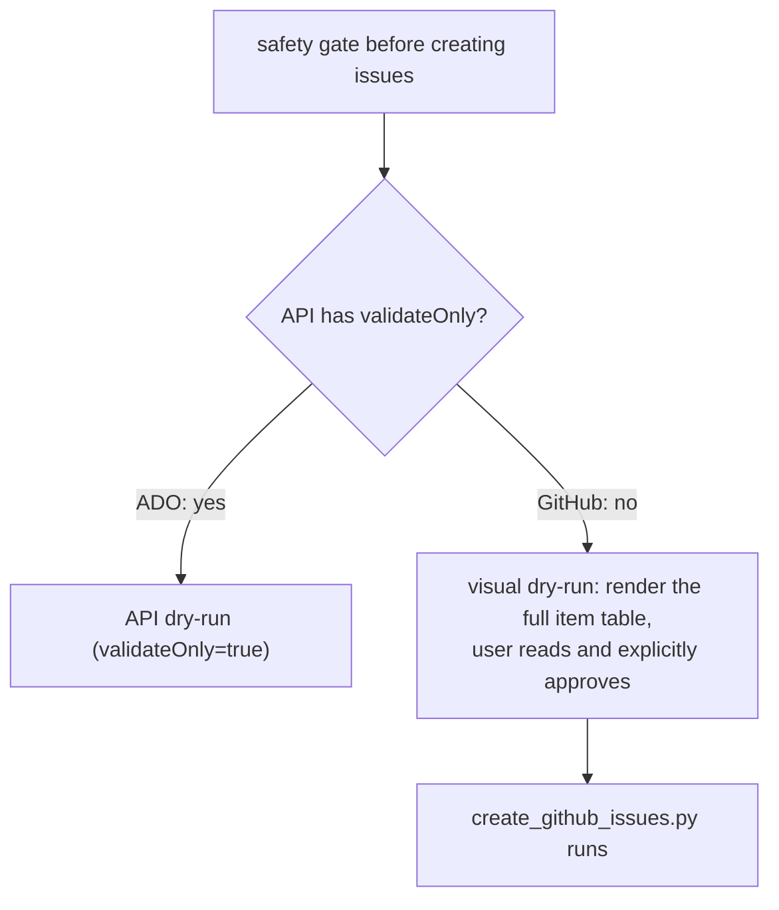

# ADR 0002 — Visual dry-run as the safety gate (GitHub has no validateOnly)

- **Status:** Accepted
- **Date:** 2026-06-02

## Context

The `ado-backlog` pipeline enforces a safety gate before any irreversible write by
running a dry run against the ADO REST API with `validateOnly=true`. ADO validates
field shapes, required fields, and work item type existence without persisting
anything. This gives API-level confidence before the real run.

GitHub Issues REST API has no equivalent `validateOnly` parameter. A POST to
`/repos/{owner}/{repo}/issues` creates the issue immediately.

The pipeline must still enforce "nothing created without the user seeing it first" —
a core safety gate — without an API-level validation round trip.

## Decision

The dry-run gate for `github-backlog` is **visual**: before calling the script,
`github-create-issues` reads `github_backlog_input.json` and renders a formatted
table (title, labels, milestone, assignee per item) in the conversation. No API
call is made. The user reads the table and gives explicit approval before
`create_github_issues.py` is invoked.

This is called a "visual dry-run" in the skill and QUICKSTART documentation to
preserve the mental model from the ADO pipeline while being honest that the
validation is human-visual, not API-level.

## Consequences

- ➕ The safety gate is preserved — nothing is created without explicit user
  approval of the exact list.
- ➕ The visual gate actually validates **content** (titles, label choices, assignees)
  which ADO's `validateOnly` does not — it only validates field shapes. The GitHub
  gate is in some ways more thorough.
- ➕ Zero API calls during review — faster and no rate-limit risk on large batches.
- ➖ Field-level validation (e.g. an invalid GitHub username in `assignees`) is not
  caught until the real run. The script surfaces these per-item without stopping
  the whole batch.
- ➖ Label name typos are not caught visually — they are created as new labels by
  `ensure_labels`. Mitigation: `classify-github-issues` uses only the canonical
  label set from `data-contracts.md`.

## Alternatives considered

- **Create issues in a test/staging repo then recreate in the real repo** — rejected:
  too much friction; doubles the API calls; test repos are not always available.
- **Skip the dry-run concept and rely only on the approval gate** — rejected: drops
  the "dry-run" framing that makes the safety model legible to users already
  familiar with `ado-backlog`.
- **Use GitHub API to validate label/milestone existence before creating** — rejected:
  this is a partial validation (doesn't check issue content) and adds complexity
  without meaningfully improving safety over the visual gate.
