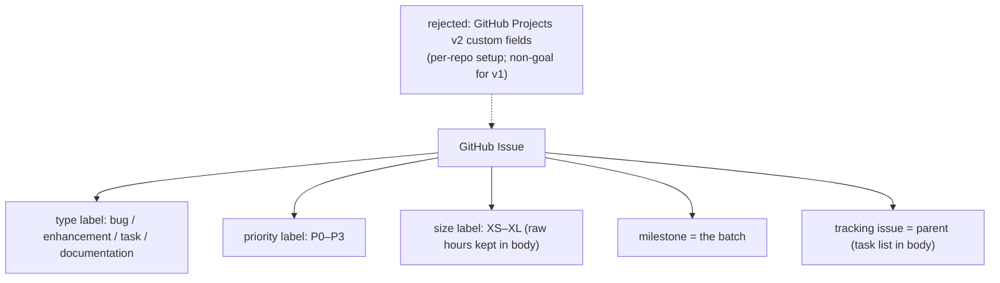

# ADR 0003 — Use labels + milestones for type/priority/size, not GitHub Projects

- **Status:** Accepted
- **Date:** 2026-06-02

## Context

GitHub Issues are flat — they have title, body, labels, assignees, and milestone.
They carry no structured fields for type (bug vs. feature), priority, or effort
estimate beyond what labels provide.

GitHub Projects (v2) adds structured custom fields (select, number, date, iteration)
on top of issues via a separate database layer. It could carry type, priority, and
story-point-style estimates as first-class fields.

The `classify-github-issues` skill must map findings to GitHub Issues and carry
type, priority, and size estimate in a way that is actionable on the board.

## Decision

Use **flat labels** for all three dimensions, following GitHub's own default label
style:

| Dimension | Labels |
|---|---|
| Type | `bug`, `enhancement`, `task`, `documentation` |
| Priority | `P0`, `P1`, `P2`, `P3` |
| Size/estimate | `size:XS` (≤2h), `size:S` (3–4h), `size:M` (5–8h), `size:L` (9–16h), `size:XL` (>16h) |

Use a **milestone** to group the batch (e.g. `Audit Wave 1`). Use a **tracking
issue** (with a task list in the body) as the parent, mirroring the ADO Feature/Epic
grouping concept.

Missing labels are auto-created by `create_github_issues.py` before the first issue,
so the pipeline is self-provisioning.

## Consequences

- ➕ Labels are native to GitHub Issues — visible in the issue list, filterable, and
  familiar to any GitHub user without onboarding.
- ➕ No GitHub Projects setup required — works on any repo out of the box, including
  repos that don't use Projects.
- ➕ The label set matches GitHub's own defaults (`bug`, `enhancement`) — teams land
  in a convention they already recognize.
- ➕ Milestones and tracking issues are standard GitHub patterns — no custom tooling
  needed to consume them.
- ➖ Labels are strings, not structured fields — sorting by priority on the Issues
  tab requires filtering by label, not a column sort. Accepted: `P0`–`P3` prefix
  sorts alphabetically, which approximates priority order.
- ➖ Size labels encode hours as t-shirt sizes — precision is lost (a `size:M` could
  be 5h or 8h). Raw hours are preserved in the issue body (`**Estimate:** Xh`) to
  survive label changes.
- ➖ No roll-up of estimates across a milestone without GitHub Projects. Accepted:
  the total is shown in the `classify-github-issues` estimates table at classification
  time.

## Alternatives considered

- **GitHub Projects custom fields** — rejected: requires Projects to be enabled and
  configured per repo; adds a separate setup step; out of scope for v1 (non-goal
  established in design).
- **Custom label prefix scheme** (e.g. `type:bug`, `priority:P1`) — rejected: non-standard,
  unfamiliar to new contributors, and adds visual noise. GitHub's own defaults use
  flat names.
- **Issue title prefix** (e.g. `[BUG][P1]`) — rejected: pollutes the title, breaks
  search, and is not machine-readable.
