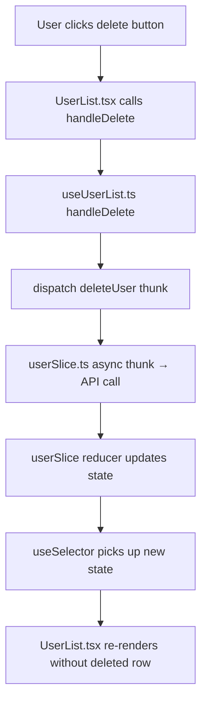

# React Structure

When working with React code in this project, always follow these conventions. The goal is to keep UI rendering cleanly separated from logic, making components easier to test, review, and maintain.

## Component file structure

Every component lives in its own folder with this layout:

```
ComponentName/
├── ComponentName.tsx      # UI only — JSX rendering, no business logic
├── useComponentName.ts    # Hook — state, handlers, side effects, data fetching
├── type.ts                # TypeScript types and interfaces for this component
└── componentSlice.ts      # Redux slice (only if this component owns Redux state)
```

### What goes where

**ComponentName.tsx** (UI file)
- JSX rendering and layout
- MUI component composition and styling (`sx` props, `styled()`)
- Calls the custom hook to get all data and handlers
- No `useState`, `useEffect`, `useSelector`, `useDispatch`, or business logic here

```tsx
// UserList.tsx
import { useUserList } from './useUserList';
import { DataGridPremium } from '@mui/x-data-grid-premium';

export const UserList = () => {
  const { rows, columns, loading, handleRowClick } = useUserList();

  return (
    <DataGridPremium
      rows={rows}
      columns={columns}
      loading={loading}
      onRowClick={handleRowClick}
    />
  );
};
```

**useComponentName.ts** (Hook file)
- All React hooks (`useState`, `useEffect`, `useMemo`, `useCallback`)
- Redux interactions (`useSelector`, `useDispatch`)
- Event handlers and business logic
- Data transformation and preparation
- Returns everything the UI file needs as a clean interface

```tsx
// useUserList.ts
import { useSelector, useDispatch } from 'react-redux';
import { GridColDef, GridRowParams } from '@mui/x-data-grid-premium';
import { selectUsers, fetchUsers } from './userSlice';
import { User } from './type';

export const useUserList = () => {
  const dispatch = useDispatch();
  const users = useSelector(selectUsers);
  const [loading, setLoading] = useState(true);

  useEffect(() => {
    dispatch(fetchUsers()).finally(() => setLoading(false));
  }, [dispatch]);

  const columns: GridColDef<User>[] = useMemo(() => [
    { field: 'name', headerName: 'Name', flex: 1 },
    { field: 'email', headerName: 'Email', flex: 1 },
  ], []);

  const handleRowClick = useCallback((params: GridRowParams<User>) => {
    // handle row click
  }, []);

  return { rows: users, columns, loading, handleRowClick };
};
```

**type.ts**
- Interfaces and types scoped to this component
- Props types, data models, enum types

```tsx
// type.ts
export interface User {
  id: string;
  name: string;
  email: string;
}

export interface UserListProps {
  filterByRole?: string;
}
```

**componentSlice.ts** (only when needed)
- Redux Toolkit slice with state, reducers, async thunks, and selectors
- Only create this file if the component owns its own piece of Redux state

## Tech stack

- **Language**: TypeScript (strict — always type props, state, and return values)
- **State management**: Redux Toolkit (`createSlice`, `createAsyncThunk`)
- **Styling**: MUI (Material UI) — use `sx` prop or `styled()` for custom styling
- **Tables**: Always use `@mui/x-data-grid-premium` (`DataGridPremium`) for any table or data grid. Never use plain HTML tables or basic MUI `Table` components when displaying tabular data.

## Planning — always show a flowchart

Before writing or modifying any code, present a Mermaid flowchart that shows the function/data flow of what you're about to change or create. This helps the user visualize the impact before any code is written.

The flowchart should cover:
- Which files are involved (hook, UI, slice, types)
- How data flows between them (props, dispatch, selectors, hook return values)
- The user actions and event handler chain

**Example** — adding a delete feature to UserList:



Always show this flowchart and get confirmation before proceeding with implementation.

## When modifying existing components

If you're editing a component that doesn't follow this structure yet, refactor it to match:

1. Extract all logic into `useComponentName.ts`
2. Extract types into `type.ts`
3. Leave only JSX rendering in `ComponentName.tsx`
4. If there's inline Redux state, move it to `componentSlice.ts`

If the change is very small (e.g., fixing a typo in a label), use judgment — don't force a full refactor for a one-word change. But for any meaningful logic or UI change, apply the structure.
